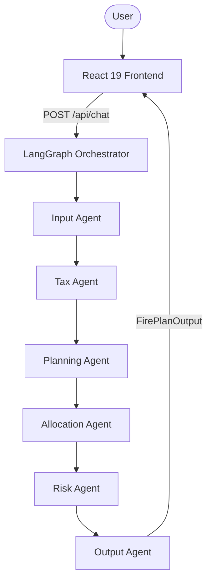

# 🔥 Mavericks — FIRE Calculator (India)
**Project Demo & Technical Documentation**

## 🌟 Overview
Mavericks is a comprehensive financial independence platform tailored for the Indian market. It leverages a multi-agent AI architecture to provide precision-engineered retirement roadmaps, tax optimization, and risk mitigation strategies.

---

## 🏗️ System Architecture

### 1. High-Level Logic Flow
The system follows a modern decoupled architecture where the React frontend communicates with a FastAPI backend to orchestrate complex financial AI workflows.



### 2. Multi-Agent Orchestration (LangGraph)
Each agent is a specialized functional unit that updates a shared `GraphState`:
- **Input Agent**: Validates age (18-80) and income consistency.
- **Tax Agent**: Implements the **FY 24-25 Indian Income Tax** logic. It calculates both Old and New regime taxes, including standard deductions (₹75k for New, ₹50k for Old) and 80C investments (up to ₹1.5L).
- **Planning Agent**: The engine of the system. It calculates the inflation-adjusted target corpus and determines if a user is already "Financial Independent" (FI).
- **Allocation Agent**: Follows SEBI-aligned risk caps (max 80% equity) and generates a yearly glidepath.
- **Risk Agent**: Computes Term Life and Health insurance gaps based on monthly expenses.

---

## 📈 Financial Sub-systems

### 1. Tax Optimization Engine
The Tax Agent dynamically recommends the most efficient regime:
- **New Regime**: Slabs at 3L, 6L, 9L, 12L, 15L. Effective rebate up to ₹7.75L (inc. standard deduction).
- **Old Regime**: Includes 80C deductions (PPF, ELSS, Insurance) and ₹50k standard deduction.

### 2. FIRE Mathematics
- **The Rule of 25**: We calculate the target corpus as `25 × (Current Monthly Expenses × 12)`.
- **Safe Withdrawal Rate (SWR)**: While the global standard is 4%, Mavericks highlights that in high-inflation environments like India, a 2.5% to 3% SWR is often more prudent.
- **Future Value (FV) Annuity**: Monthly investments (SIP) are projected using:
  `Corpus = SIP × [((1 + r)^n - 1) / r] × (1 + r)`
  *(where r = monthly return, n = total months)*

### 3. Portfolio Comparison
- **India Only**: Default 12% equity return (representative of Nifty 50 long-term).
- **Global Portfolio**: Uses a 60/40 blend of Nifty 50 and S&P 500, accounting for INR-USD currency depreciation (estimated at 3-4% annually).

---

## 🤖 AI Technical Stack

### 1. RAG (Retrieval Augmented Generation)
Used in the "AI Advisor" tab to handle custom knowledge bases:
- **Vector DB**: In-memory **FAISS** index created dynamically per session.
- **Embeddings**: `models/gemini-embedding-001`.
- **Document Handling**: Supports PDF extraction and raw text processing.
- **Retrieval Modes**:
    - **Web Info**: LLM's internal knowledge + Context.
    - **Strict RAG**: Strictly limits answers to the provided documents (Zero external knowledge).

### 2. Prompt Engineering
- **Concise UI**: The system prompt is optimized to provide short, actionable answers (2-3 sentences) with professional markdown bolding for key terms.
- **Role Alignment**: Specific system roles (e.g., "STRICT RAG ADVISOR", "WEB-INFORMED FINANCIAL AI") ensure consistent tone and constraint adherence.

---

## 🔗 Port & API Reference

| Endpoint | Method | Purpose |
| :--- | :--- | :--- |
| `/api/chat` | POST | Triggers the LangGraph multi-agent orchestration. |
| `/api/advisor` | POST | Chatbot endpoint for RAG or General Knowledge queries. |
| `/api/upload` | POST | Uploads documents (PDF/Text) to the session-based vector store. |
| `/api/documents` | GET | Lists all uploaded documents for the current session. |
| `/health` | GET | Basic server health check. |

---

## 🚦 Setup Instructions

### Backend
```bash
# From /backend directory
python3 -m venv venv
source venv/bin/activate
pip install -r requirements.txt
./start_backend.sh
```

### Frontend
```bash
# From root directory
npm install
npm run dev
```

---
*Disclaimer: Mavericks is an AI-powered educational tool. It is not a substitute for professional financial advice from a licensed SEBI RIA.*
